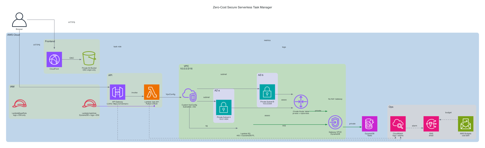

# Architecture Overview

## Project: Zero-Cost Secure Serverless Task Manager

### Summary

This application is a fully serverless task manager deployed entirely on AWS. The architecture is specifically designed to operate at **zero cost** by staying within AWS Free Tier limits and eliminating the primary cost driver in typical VPC deployments: the **NAT Gateway** (~$32/month).

---

## Architecture Diagram



> Generated by `scripts/generate_diagram.py` using the [Diagrams](https://diagrams.mingrammer.com/) library and the local AWS official icon package in the repo.

---

## Components

### 1. User (Browser)

End users access the application via a web browser. All traffic enters through CloudFront — no direct access to origin resources is permitted.

---

### 2. Frontend Layer

| Service | Role |
|---|---|
| **Amazon S3** | Hosts the static frontend (`index.html`, `app.js`). All four Block Public Access settings are enabled; direct S3 URLs return `403 Forbidden`. |
| **Amazon CloudFront** | CDN that serves the S3 content over HTTPS. Uses **Origin Access Control (OAC)** so only CloudFront can read from the S3 bucket. |

---

### 3. API Layer

| Service | Role |
|---|---|
| **Amazon API Gateway** (REST) | Exposes four RESTful endpoints (`GET /tasks`, `POST /tasks`, `PUT /tasks/{id}`, `DELETE /tasks/{id}`). Configured with a `prod` stage and CORS restricted to the CloudFront domain only. |

---

### 4. Compute Layer

| Service | Role |
|---|---|
| **AWS Lambda** (Python 3.x) | Single function (`lambda_function.py`) handles all four CRUD operations. Uses explicit **`VpcConfig`** and private ENIs across **two private subnets in two AZs** with no internet route. |

Lambda execution roles:

- **`LambdaTaskRole`** — granted `dynamodb:GetItem`, `PutItem`, `UpdateItem`, `DeleteItem`, `Query`, `Scan` scoped to the exact table ARN, plus CloudWatch Logs.
- **`LambdaBaseRole`** — CloudWatch Logs and VPC ENI actions only (no DynamoDB access). Used for non-data Lambda functions.

---

### 5. Database Layer

| Service | Role |
|---|---|
| **Amazon DynamoDB** | On-demand (pay-per-request) table `Tasks`. Primary key: `taskId` (UUID). Global Secondary Index (GSI) on `userId` for per-user queries. |

---

### 6. Networking — The Zero-Cost Design

```
Lambda (private subnet)
        │
        │  ← No NAT Gateway (saves ~$32/month)
        │
   VPC Endpoint
  (Gateway type, DynamoDB)
        │
   DynamoDB (AWS-managed)
```

| Component | Purpose |
|---|---|
| **VPC** | Isolates Lambda in a private network. |
| **Private Subnets (2)** | Lambda ENIs are placed here across two AZs; no route to an Internet Gateway. |
| **VPC Endpoint (Gateway)** | `com.amazonaws.<region>.dynamodb` — routes DynamoDB traffic through the AWS backbone, not the public internet. Free for Gateway endpoints. |
| **Route Table** | Contains a route `pl-XXXXX (dynamodb) → vpce-XXXXX` pointing to the VPC Endpoint. |
| **Security Group** | Lambda egress is restricted to outbound `443` only to the DynamoDB prefix list. |

> **Why no NAT Gateway?**  
> Lambda only needs to reach DynamoDB. Because a Gateway VPC Endpoint is free and routes traffic privately, a NAT Gateway is completely unnecessary. This single decision eliminates the largest recurring cost in the architecture.

---

### 7. Security

| Control | Implementation |
|---|---|
| S3 access | Block Public Access (all 4 settings) + CloudFront OAC |
| API authentication | API key / IAM (configurable); `userId` currently hardcoded for demo |
| Lambda network | Private subnet; no outbound internet route |
| DynamoDB access | IAM least-privilege via `LambdaTaskRole`; resource ARN scoped to single table |
| CORS | Handled in Lambda `build_response()` with `Access-Control-Allow-Origin` set to the CloudFront domain only |

---

### 8. Monitoring & Observability

| Service | What it monitors |
|---|---|
| **CloudWatch Logs** | Lambda execution logs (request/response, errors) |
| **CloudWatch Dashboard** | 5 widgets: Lambda invocations, errors, duration; API Gateway 4XX/5XX counts |
| **CloudWatch Alarm — `Lambda-Error-Alarm`** | Triggers when Lambda errors > 10 in a 5-minute window |
| **CloudWatch Alarm — `API-5xx-Alarm`** | Triggers when API Gateway 5XX errors > 5 in a 5-minute window |
| **AWS Budgets** | Monthly cost alert threshold |

---

## Data Flow

### Read Tasks (GET /tasks)

```
Browser
  → CloudFront (HTTPS)
    → S3 (static HTML/JS)      [one-time page load]

Browser (JS fetch)
  → API Gateway /tasks?userId=xxx
    → Lambda (invoke)
      → DynamoDB Query (userId-index GSI)  [via VPC Endpoint]
        ← Items []
      ← JSON response
    ← 200 OK + task list
  ← render tasks in DOM
```

### Create Task (POST /tasks)

```
Browser (JS fetch)
  → API Gateway POST /tasks
    → Lambda
      → DynamoDB PutItem (new UUID taskId)  [via VPC Endpoint]
        ← success
      ← 201 Created + item
    ← refresh task list
```

---

## Cost Breakdown

| Service | Free Tier | Estimated Usage | Cost |
|---|---|---|---|
| Lambda | 1M req + 400K GB-s/month | < 10K req/month | **$0** |
| API Gateway | 1M REST calls/month | < 10K req/month | **$0** |
| DynamoDB | 25 GB + 25 WCU/RCU | < 1 MB, on-demand | **$0** |
| S3 | 5 GB + 20K GET | Static files only | **$0** |
| CloudFront | 1 TB + 10M req | Minimal | **$0** |
| VPC Endpoint (Gateway) | Always free | 1 endpoint | **$0** |
| NAT Gateway | Not free | **Not used** | **$0** |
| **Total** | | | **~$0/month** |

---

## Diagram Generation

The architecture diagram is generated programmatically:

```bash
# One-time setup
python3.12 -m venv .venv-diagrams
.venv-diagrams/bin/python -m pip install diagrams graphviz

# Generate the diagram
.venv-diagrams/bin/python scripts/generate_diagram.py
# Output: docs/architecture.png
```
